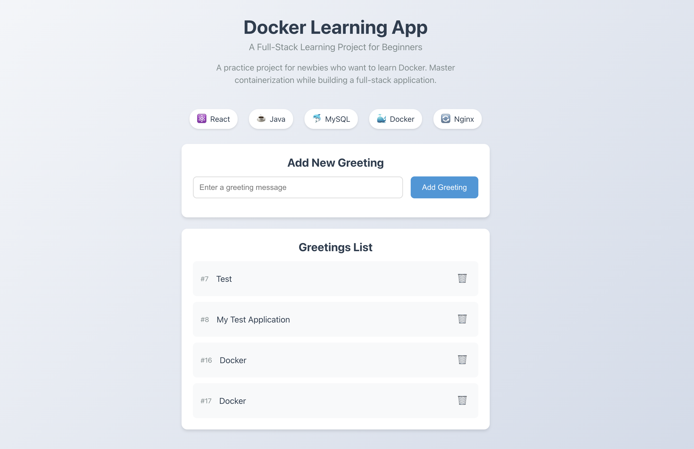

# Docker Learning App


A practice project for newbies who want to learn Docker. This project demonstrates how to containerize a full-stack application using Docker and Docker Compose.

## 🖼️ Application Preview



## 🚀 Tech Stack

- **Frontend**: React.js with TypeScript
- **Backend**: Spring Boot (Java)
- **Database**: MySQL
- **Web Server**: Nginx
- **Containerization**: Docker & Docker Compose

## 📋 Prerequisites

- Docker
- Docker Compose
- Git

## 🛠️ Project Structure

```
.
├── frontend/          # React frontend application
├── backend/          # Spring Boot backend application
├── compose.yaml      # Docker Compose configuration
└── README.md         # This file
```

## 🚀 Getting Started

1. Clone the repository:
   ```bash
   git clone <repository-url>
   cd docker-learning-app
   ```

2. Start the application:
   ```bash
   docker compose up --build
   ```

3. Access the application:
   - Frontend: http://localhost:3000
   - Backend API: http://localhost:8080

## 📚 What You'll Learn

### Docker Fundamentals
- Containerization basics
- Docker images and multi-stage builds
- Container lifecycle management

### Container Orchestration
- Docker Compose for multi-container applications
- Service dependencies and networking
- Environment configuration

### Networking & Services
- Container networking
- Service communication
- Port mapping and exposure

### Full-Stack Containerization
- Containerizing frontend applications
- Containerizing backend services
- Database containerization
- Nginx as a reverse proxy

## 🔧 Key Features

- Multi-stage Docker builds for optimized images
- Docker Compose for service orchestration
- Environment variable configuration
- Health checks for service dependencies
- Nginx for serving static files
- MySQL database with persistent storage

## 🐳 Docker Commands

### Build and Start
```bash
docker compose up --build
```

### Stop Services
```bash
docker compose down
```

### View Logs
```bash
docker compose logs -f
```

### Rebuild a Specific Service
```bash
docker compose up --build <service-name>
```

## 📝 Notes

- The application uses environment variables for configuration
- Database data is persisted using Docker volumes
- The frontend is served through Nginx
- The backend API is accessible on port 8080

## 🔍 Architecture

1. Browser loads the React application from Nginx web server
2. React renders the UI and makes API requests directly from the browser to Spring Boot backend
3. Spring Boot processes requests and interacts with MySQL database
4. All components run in Docker containers for easy deployment

## 🤝 Contributing

Feel free to submit issues and enhancement requests!

## 📄 License

This project is open source and available under the MIT License.

## Compose sample application

### React application with a Spring backend and a MySQL database

Project structure:
```
.
├── backend
│   ├── Dockerfile
│   ...
├── db
│   └── password.txt
├── compose.yaml
├── frontend
│   ├── ...
│   └── Dockerfile
└── README.md
```

[_compose.yaml_](compose.yaml)
```
services:
  backend:
    build: backend
    ...
  db:
    # We use a mariadb image which supports both amd64 & arm64 architecture
    image: mariadb:10.6.4-focal
    # If you really want to use MySQL, uncomment the following line
    #image: mysql:8.0.27
    ...
  frontend:
    build: frontend
    ports:
    - 3000:3000
    ...
```
The compose file defines an application with three services `frontend`, `backend` and `db`.
When deploying the application, docker compose maps port 3000 of the frontend service container to port 3000 of the host as specified in the file.
Make sure port 3000 on the host is not already being in use.

> ℹ️ **_INFO_**
> For compatibility purpose between `AMD64` and `ARM64` architecture, we use a MariaDB as database instead of MySQL.
> You still can use the MySQL image by uncommenting the following line in the Compose file
> `#image: mysql:8.0.27`

## Deploy with docker compose

```
$ docker compose up -d
Creating network "react-java-mysql-default" with the default driver
Building backend
Step 1/17 : FROM maven:3.6.3-jdk-11 AS builder
...
Successfully tagged react-java-mysql_frontend:latest
WARNING: Image for service frontend was built because it did not already exist. To rebuild this image you must use `docker-compose build` or `docker-compose up --build`.
Creating react-java-mysql-frontend-1 ... done
Creating react-java-mysql-db-1       ... done
Creating react-java-mysql-backend-1  ... done
```

## Expected result

Listing containers must show three containers running and the port mapping as below:
```
$ docker ps
ONTAINER ID        IMAGE                       COMMAND                  CREATED             STATUS              PORTS                  NAMES
a63dee74d79e        react-java-mysql-backend    "java -Djava.securit…"   39 seconds ago      Up 37 seconds                              react-java-mysql_backend-1
6a7364c0812e        react-java-mysql-frontend   "docker-entrypoint.s…"   39 seconds ago      Up 33 seconds       0.0.0.0:3000->3000/tcp react-java-mysql_frontend-1
b176b18fbec4        mysql:8.0.19                "docker-entrypoint.s…"   39 seconds ago      Up 37 seconds       3306/tcp, 33060/tcp    react-java-mysql_db-1
```

After the application starts, navigate to `http://localhost:3000` in your web browser to get a colorful message.

Stop and remove the containers
```
$ docker compose down
Stopping react-java-mysql-backend-1  ... done
Stopping react-java-mysql-frontend-1 ... done
Stopping react-java-mysql-db-1       ... done
Removing react-java-mysql-backend-1  ... done
Removing react-java-mysql-frontend-1 ... done
Removing react-java-mysql-db-1       ... done
Removing network react-java-mysql-default
```
